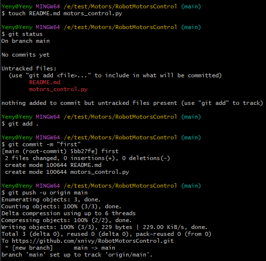
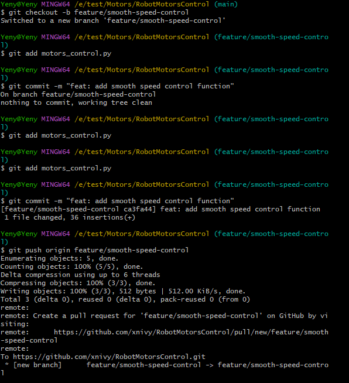
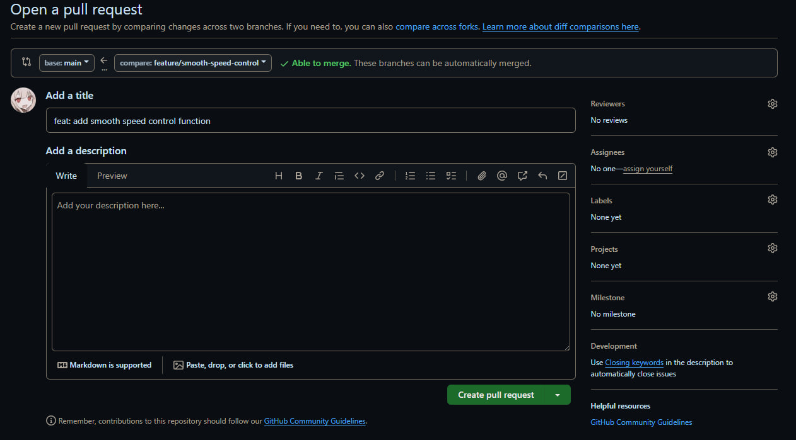
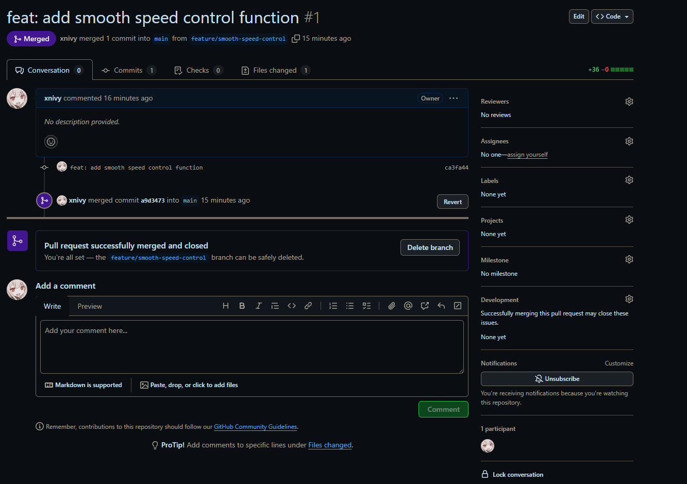
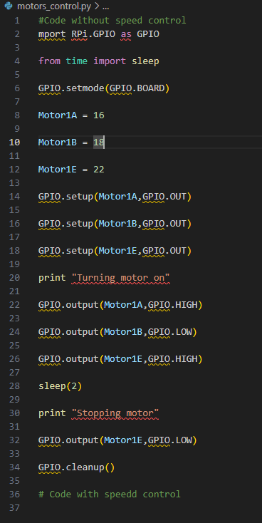
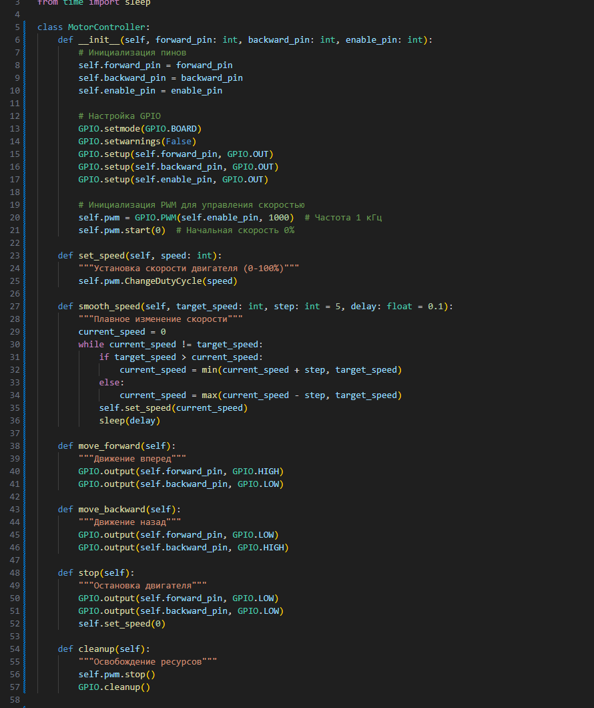

# RobotMotorsControl 🤖

Проект для управления двигателями робота с использованием Python и Git.

---

## 📌 Общее описание проекта
**Цель:** Создание системы плавного управления скоростью двигателей робота.  
**Назначение:**  
- Реализация базовых функций управления моторами.  
- Добавление алгоритмов плавного старта/остановки.  
- Интеграция с аппаратной частью робота (опционально).

---

## 🛠️ Работа с Git

### 1. Создание и клонирование репозитория
- Репозиторий создан на GitHub: [RobotMotorsControl](https://github.com/xnivy/RobotMotorsControl).  
- (изначально были в папке были созданы файлы и после уже был подключен гит репоз потому что нельзя клонировать пустой репоз
и нельзя создавать на сайте Github репозиторий сразу вместе с файлами кроме как Readme.md 
а задание как раз подрузомевает создание Readme.md через консоль а не изначально через сайт
в любом случае git clone https://github.com/xnivy/RobotMotorsControl вот команда для копирования репоза :o)
- создание кода:

- Клонирование на локальную машину:  
  ```bash
  git clone https://github.com/ваш-логин/RobotMotorsControl.git
  cd RobotMotorsControl
2. Процесс сохранения изменений
Добавление файлов в отслеживание:


git push origin main
3. Ветвление и слияние
Создание ветки для новой функции:

bash
Copy
git checkout -b feature/smooth-speed-control
После внесения изменений:

bash
Copy
git add motors_control.py
git commit -m "feat: добавлена функция smooth_speed()"
git push origin feature/smooth-speed-control
Слияние с main через Pull Request на GitHub:
Пример Pull Request


4. Пул-реквесты
Название PR: Merge feature/smooth-speed-control into main



python
Copy
# Было
В целом код был взять как примерный и содержит ошибки и не запускается

# Стало

✨ Основные изменения в коде
Отчёт: что было и что стало
Исходный код (без управления скоростью):
import RPi.GPIO as GPIO
from time import sleep

GPIO.setmode(GPIO.BOARD)

Motor1A = 16
Motor1B = 18
Motor1E = 22

GPIO.setup(Motor1A, GPIO.OUT)
GPIO.setup(Motor1B, GPIO.OUT)
GPIO.setup(Motor1E, GPIO.OUT)

# Включение мотора на полной скорости
print("Turning motor on")
GPIO.output(Motor1A, GPIO.HIGH)
GPIO.output(Motor1B, GPIO.LOW)
GPIO.output(Motor1E, GPIO.HIGH)

sleep(2)

# Резкая остановка
print("Stopping motor")
GPIO.output(Motor1E, GPIO.LOW)
GPIO.cleanup()
Проблемы:

Нет управления скоростью (всегда 100% мощность).

Резкий старт и остановка (риск перегрузки мотора).

Нет структуры: код линейный, сложно масштабировать.

Работает только на Raspberry Pi.

Изменённый код (с управлением скоростью):
# Добавлена заглушка для работы на ПК
import sys
sys.modules['RPi'] = __import__('fake_rpi').RPi
sys.modules['RPi.GPIO'] = __import__('fake_rpi').RPigpio

import RPi.GPIO as GPIO
from time import sleep

class MotorController:
    def __init__(self, forward_pin: int, backward_pin: int, enable_pin: int):
        # Инициализация пинов и PWM
        self.forward_pin = forward_pin
        self.backward_pin = backward_pin
        self.enable_pin = enable_pin
        GPIO.setmode(GPIO.BOARD)
        GPIO.setup(self.forward_pin, GPIO.OUT)
        GPIO.setup(self.backward_pin, GPIO.OUT)
        GPIO.setup(self.enable_pin, GPIO.OUT)
        self.pwm = GPIO.PWM(self.enable_pin, 1000)
        self.pwm.start(0)

    def smooth_speed(self, target_speed: int, step: int = 5, delay: float = 0.1):
        """Плавное изменение скорости"""
        current_speed = 0
        while current_speed != target_speed:
            current_speed += step if target_speed > current_speed else -step
            self.pwm.ChangeDutyCycle(current_speed)
            sleep(delay)

    # ... остальные методы (move_forward, move_backward, stop, cleanup)

# Пример использования
if __name__ == "__main__":
    try:
        motor = MotorController(16, 18, 22)
        motor.move_forward()
        motor.smooth_speed(80)  # Плавный разгон до 80%
        sleep(2)
        motor.smooth_speed(0)   # Плавная остановка
    finally:
        motor.cleanup()
Ключевые улучшения:
Аспект	Было	Стало
Управление скоростью	Только ВКЛ/ВЫКЛ (100% или 0%)	ШИМ (PWM) с регулировкой от 0% до 100%
Старт/Стоп	Резкое включение	Плавное изменение скорости через smooth_speed()
Архитектура	Линейный скрипт	Класс MotorController с методами
Безопасность	Нет обработки ошибок	Автоматическая очистка GPIO в cleanup()
Кросс-платформенность	Работает только на Raspberry Pi	Заглушка fake-rpi для тестирования на ПК
Документация	Отсутствует	Методы имеют docstrings
Пример работы:
На Raspberry Pi:

Мотор плавно разгоняется до заданной скорости.

Нет риска перегрузки из-за резких изменений.

На ПК:

Код запускается без ошибок (ModuleNotFoundError устранён).

В консоли выводятся логи:

Copy
Плавный старт двигателя...
Плавная остановка...
Ресурсы освобождены
Итог:
Код превратился из простого скрипта для включения мотора в полноценную библиотеку для управления двигателями с поддержкой плавного контроля скорости, безопасной работы и кросс-платформенного тестирования.
📝 Заключение
Итоги:

Успешно освоены основы работы с Git: ветвление, коммиты, пул-реквесты.