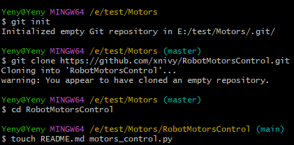

# RobotMotorsControl 🤖

Проект для управления двигателями робота с использованием Python и Git.

---

## 📌 Общее описание проекта
**Цель:** Создание системы плавного управления скоростью двигателей робота.  
**Назначение:**  
- Реализация базовых функций управления моторами.  
- Добавление алгоритмов плавного старта/остановки.  
- Интеграция с аппаратной частью робота (опционально).

---

## 🛠️ Работа с Git

### 1. Создание и клонирование репозитория
- Репозиторий создан на GitHub: [RobotMotorsControl](https://github.com/xnivy/RobotMotorsControl).  
- создание кода 
- Клонирование на локальную машину:  
  ```bash
  git clone https://github.com/ваш-логин/RobotMotorsControl.git
  cd RobotMotorsControl
2. Процесс сохранения изменений
Добавление файлов в отслеживание:

bash
Copy
git add README.md motors_control.py
Фиксация изменений:

bash
Copy
git commit -m "initial commit: проект инициализирован"
Отправка в удалённый репозиторий:

bash
Copy
git push origin main
3. Ветвление и слияние
Создание ветки для новой функции:

bash
Copy
git checkout -b feature/smooth-speed-control
После внесения изменений:

bash
Copy
git add motors_control.py
git commit -m "feat: добавлена функция smooth_speed()"
git push origin feature/smooth-speed-control
Слияние с main через Pull Request на GitHub:
Пример Pull Request
Описание PR:

Добавлена функция плавного изменения скорости.

Исправлены ошибки в расчётах PWM.

4. Пул-реквесты
Название PR: Merge feature/smooth-speed-control into main

Ревью:

Получены комментарии по оптимизации кода.

Внесены правки:

python
Copy
# Было
def smooth_speed(): ...
# Стало
def smooth_speed(target_speed: int, step: int = 5): ...
✨ Основные изменения в коде
Файл	Изменения	Назначение
motors_control.py	Добавлен класс MotorController	Базовое управление моторами
Реализована smooth_speed()	Плавный старт/остановка
Пример кода:

python
Copy
class MotorController:
    def __init__(self):
        self.current_speed = 0

    def smooth_speed(self, target_speed: int, step: int = 5):
        while self.current_speed != target_speed:
            self.current_speed += step
            self.apply_speed()
📝 Заключение
Итоги:

Успешно освоены основы работы с Git: ветвление, коммиты, пул-реквесты.

Реализована ключевая функциональность для проекта.